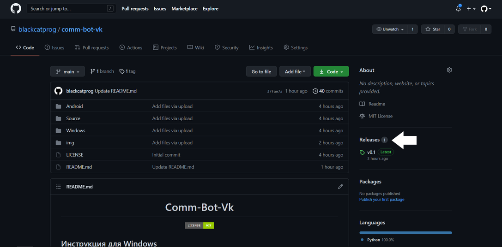
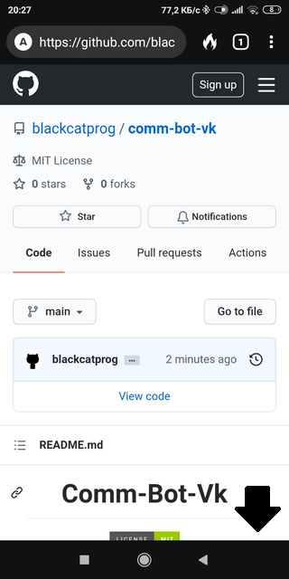
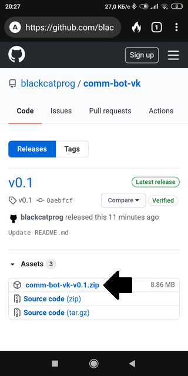

<h1 align="center">Comm-Bot-Vk</h1>

<p align="center">
<a href="https://github.com/blackcatprog/folder_icons/blob/main/LICENSE"></a> 
</p>

## Документация

* [Инструкция для Windows](#win-instruct)
* [Инструкция для Android](#andro-instruct)
* [Инструкция для Soucre(исходного кода)](#source-instruct)
	* [Windows](#source-win-instruct)
	* [Android](#source-andro-instruct)

## Инструкция для Windows <a name="win-instruct"></a>

1) Скачиваем архив с программой:




2) Распаковываем

3) Запускаем comm-bot-win.exe из папки Windows

4) Вводим необходимые данные (Инструкции по получению токена и id поста и пользователя ниже, они одинаковые для Android и Windows) и ожидаем окончания накрутки

## Инструкция для Android <a name="andro-instruct"></a>

1) Скачиваем архив с программой:






2) [Скачиваем Termux](https://play.google.com/store/apps/details?id=com.termux "Скачать Termux")

3) Обновляем все доступные пакеты:

```
pkg update
pkg upgrade
```

4) Устанавливаем python:

```
pkg install python
```

5) Даём доступ к внутренней памяти:

```
termux-setup-storage
```

6) Переходим в место, куда вы распаковали архив с программой:

```
cd storage
cd shared
cd Android (если вы распаковали в корневую папку)
```

7) Устанавливаем всё необходимое:

```
pip install -r requirements.txt
```

8) [Получаем токен](https://vkhost.github.io "Получить токен")<br>Выберите Vk Admin и скопируйте часть адресной строки от access_token= до &expires_in

9) Получаем id пользователя и id поста<br>Для этого скопируйте ссылку на пост (id пользователя от wall до _ , а id поста - всё после _

10) Запускаем скрипт:

```
python comm-bot-vk.py
```

11) Вводим все необходимые данные и ждём окончания накрутки.

## Запуск из Source <a name="source-instruct"></a>

### Для Windows <a name="source-win-instruct"></a>

1) Скачиваем архив с программой (скриншоты выше)

2) Распаковываем

3) [Устанавливаем Python с официального сайта](https://python.org "Установить Python") (если у вас не установлен)

4) Запускаем консоль сочетанием клавиш Win+R, вводим cmd и нажимаем Enter

5) Переходим в папку с программой (Нужно перейти туда, куда вы распаковали архив и открыть папку Source)<br>Ниже приведён пример с папкой на рабочем столе)

```
cd Desktop
cd Source
```

6)  Устанавливаем всё необходимое:

```
pip install -r requirements.txt
```

8) Вписываем всё необходимое в cfg.ini (Инструкции по получению токена и id поста и пользователя выше, они одинаковые для Android и Windows)

9) В консоли вводим python comm-bot-vk.py, выбираем сколько нужно комментариев и ожидаем окончания накрутки

###  Для Android <a name="source-andro-instruct"></a>

1) Повторяем с 1 по 9 пункты [этой инструкции](https://github.com/blackcatprog/comm-bot-vk/blob/main/README.md##%D0%B8%D0%BD%D1%81%D1%82%D1%80%D1%83%D0%BA%D1%86%D0%B8%D1%8F-%D0%B4%D0%BB%D1%8F-android)

2) Вписываем всё необходимое в cfg.ini (Инструкции по получению токена и id поста и пользователя выше, они одинаковые для Android и Windows)

3) Запускаем скрипт, вводим желаемое количество количество комментариев и ожидаем окончания накрутки
